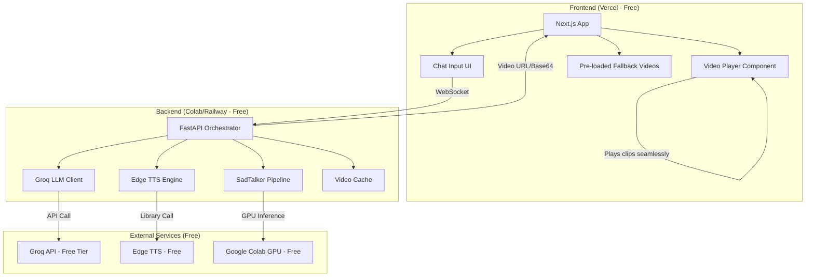
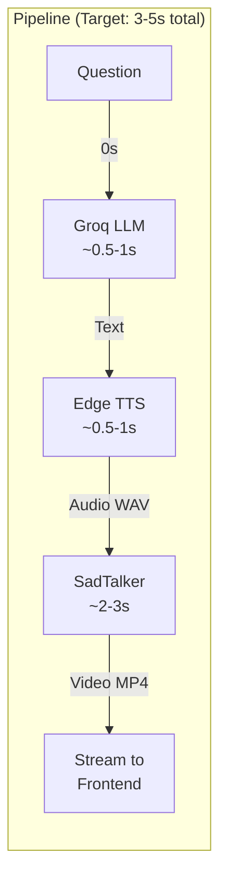
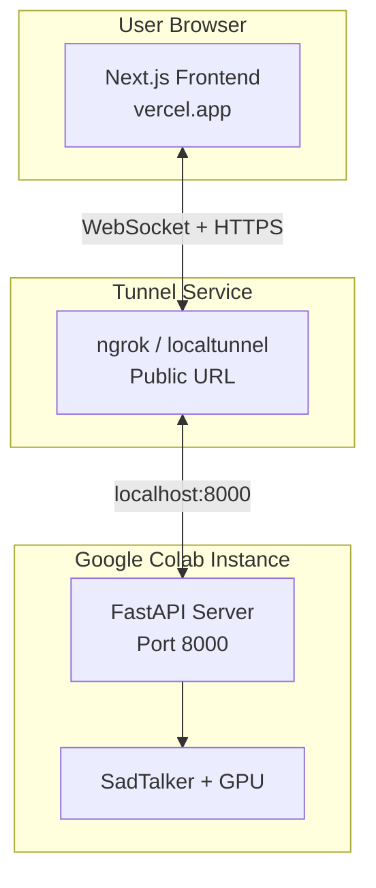
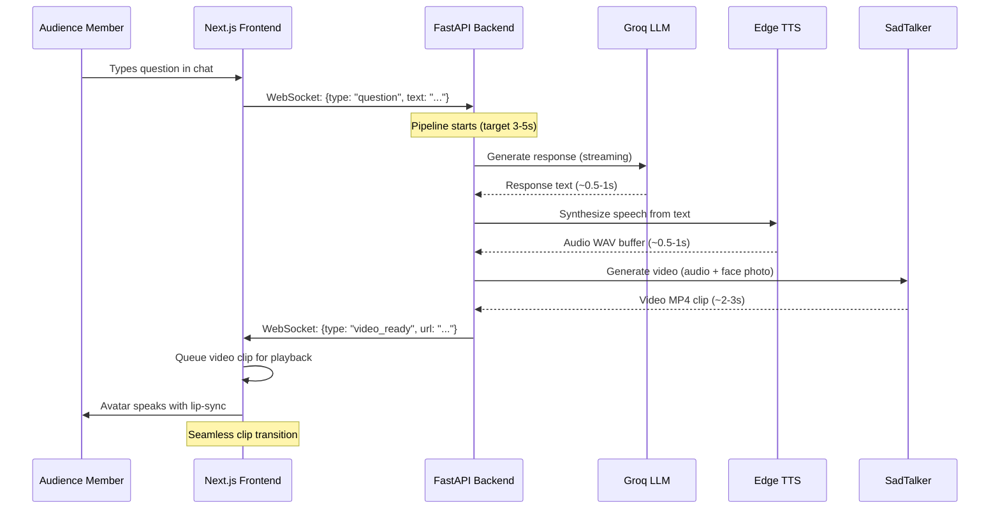
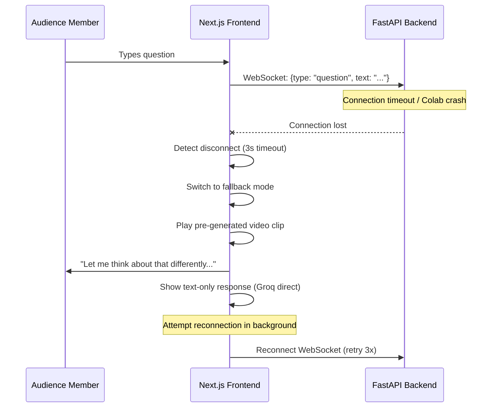
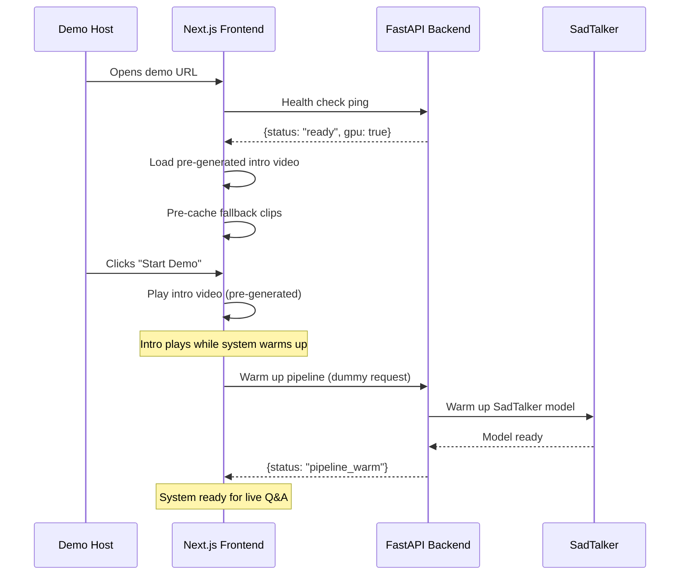

# Design Document: GirishOS Live Avatar

## Overview

GirishOS is an AI-powered interactive meeting host that transforms "AI pe Charcha" meetings into engaging, fun experiences. The system presents a realistic AI avatar of "Girish" that can respond to live audience questions with voice and animated facial expressions in real-time (3-5 second response latency).

The architecture is a pipeline: audience question → Groq LLM generates response → Edge TTS synthesizes speech → SadTalker animates avatar video → frontend streams the clip seamlessly. The entire stack is free-tier: Groq (LLM), Edge TTS (voice), SadTalker on Google Colab (face animation with free GPU), Next.js on Vercel (frontend), and FastAPI on Colab/Railway (backend orchestration).

Reliability is the top priority — the system must survive a full 20-minute live demo without failure. This demands aggressive fallback strategies, pre-generated content buffers, and connection keep-alive mechanisms for the inherently unstable Colab environment.

## Architecture

### System Overview



### Data Flow Architecture



### Connection Topology



## Sequence Diagrams

### Main Interaction Flow (Happy Path)



### Fallback Flow (Colab Disconnect)



### Demo Startup Sequence



## Components and Interfaces

### Component 1: Frontend Video Player (Next.js)

**Purpose**: Manages seamless playback of avatar video clips, handles transitions between clips, and provides fallback UI when backend is unavailable.

**Interface**:
```typescript
interface VideoPlayerProps {
  onReady: () => void;
  onError: (error: Error) => void;
}

interface VideoQueueManager {
  enqueue(clip: VideoClip): void;
  playNext(): void;
  getCurrentState(): PlayerState;
  setFallbackMode(enabled: boolean): void;
}

interface VideoClip {
  id: string;
  url: string;
  duration: number;
  type: 'live' | 'pregenerated' | 'fallback';
  text: string; // subtitle text
}

type PlayerState = 'idle' | 'playing' | 'buffering' | 'fallback';
```

**Responsibilities**:
- Queue and play video clips without visible gaps
- Cross-fade between clips for seamless experience
- Switch to fallback mode (pre-generated clips) on backend failure
- Display subtitles synchronized with video
- Show "thinking" animation while waiting for response

### Component 2: WebSocket Connection Manager (Frontend)

**Purpose**: Maintains persistent WebSocket connection to backend with automatic reconnection and heartbeat monitoring.

**Interface**:
```typescript
interface ConnectionManager {
  connect(url: string): Promise<void>;
  disconnect(): void;
  send(message: ClientMessage): void;
  onMessage(handler: (msg: ServerMessage) => void): void;
  getStatus(): ConnectionStatus;
}

type ClientMessage = 
  | { type: 'question'; text: string; id: string }
  | { type: 'heartbeat' }
  | { type: 'cancel'; questionId: string };

type ServerMessage =
  | { type: 'video_ready'; questionId: string; url: string; duration: number; text: string }
  | { type: 'processing'; questionId: string; stage: PipelineStage }
  | { type: 'error'; questionId: string; message: string; fallback: boolean }
  | { type: 'heartbeat_ack' };

type PipelineStage = 'llm' | 'tts' | 'animation' | 'encoding';
type ConnectionStatus = 'connected' | 'connecting' | 'disconnected' | 'reconnecting';
```

**Responsibilities**:
- Establish and maintain WebSocket connection through ngrok tunnel
- Send heartbeat every 10 seconds to detect disconnection early
- Auto-reconnect with exponential backoff (max 3 attempts)
- Notify UI of connection state changes
- Queue messages during brief disconnections

### Component 3: FastAPI Orchestrator (Backend)

**Purpose**: Coordinates the entire pipeline from question to video, manages concurrent requests, and handles errors gracefully.

**Interface**:
```python
class PipelineOrchestrator:
    async def process_question(self, question: str, question_id: str) -> VideoResult:
        """Full pipeline: question → LLM → TTS → SadTalker → video URL"""
        ...

    async def health_check(self) -> HealthStatus:
        """Check all pipeline components are operational"""
        ...

    async def warm_up(self) -> bool:
        """Pre-load models and warm caches"""
        ...

class VideoResult:
    video_url: str
    duration: float
    text_response: str
    generation_time: float

class HealthStatus:
    groq_available: bool
    tts_available: bool
    sadtalker_ready: bool
    gpu_memory_free: float
    uptime_seconds: float
```

**Responsibilities**:
- Orchestrate the 3-stage pipeline (LLM → TTS → Animation)
- Manage request queue (process one at a time to avoid GPU contention)
- Cache recent responses to avoid regenerating identical answers
- Report pipeline stage progress via WebSocket
- Handle timeouts at each stage with graceful degradation

### Component 4: Groq LLM Client

**Purpose**: Generates conversational responses with the personality of "Girish" — witty, knowledgeable about AI, and engaging.

**Interface**:
```python
class GroqClient:
    async def generate_response(
        self,
        question: str,
        context: ConversationContext,
        max_tokens: int = 150
    ) -> LLMResponse:
        """Generate a response as GirishOS personality"""
        ...

class ConversationContext:
    history: list[dict]  # Last 5 Q&A pairs
    meeting_stage: str   # 'intro' | 'qa' | 'game' | 'closing'
    personality_prompt: str

class LLMResponse:
    text: str
    tokens_used: int
    latency_ms: float
```

**Responsibilities**:
- Maintain GirishOS personality across responses
- Keep responses concise (2-3 sentences max for fast TTS)
- Handle rate limiting gracefully
- Provide fallback responses if API is down

### Component 5: Edge TTS Engine

**Purpose**: Converts text responses to natural-sounding speech audio using Microsoft Edge's free TTS service.

**Interface**:
```python
class EdgeTTSEngine:
    async def synthesize(
        self,
        text: str,
        voice: str = "en-IN-PrabhatNeural",
        rate: str = "+10%",
        pitch: str = "+0Hz"
    ) -> AudioResult:
        """Convert text to speech audio"""
        ...

class AudioResult:
    audio_bytes: bytes  # WAV format
    duration_seconds: float
    sample_rate: int  # 24000 Hz
    format: str  # "wav"
```

**Responsibilities**:
- Synthesize speech with Indian English voice (en-IN-PrabhatNeural)
- Output WAV format compatible with SadTalker input
- Keep audio under 15 seconds per clip (for fast animation)
- Handle network errors with retry logic

### Component 6: SadTalker Animation Engine

**Purpose**: Generates realistic talking-head video from a single photo and audio input, with lip-sync and facial expressions.

**Interface**:
```python
class SadTalkerEngine:
    def __init__(self, source_image_path: str, checkpoint_dir: str):
        """Initialize with Girish's photo and model checkpoints"""
        ...

    async def generate_video(
        self,
        audio_path: str,
        expression_scale: float = 1.0,
        pose_style: int = 0
    ) -> VideoResult:
        """Generate talking head video from audio"""
        ...

    def warm_up(self) -> bool:
        """Pre-load models into GPU memory"""
        ...

class VideoResult:
    video_path: str  # Path to generated MP4
    duration_seconds: float
    resolution: tuple[int, int]  # (256, 256) or (512, 512)
    fps: int  # 25
    generation_time: float
```

**Responsibilities**:
- Generate lip-synced video from audio + source photo
- Use 256x256 resolution for speed (upgrade to 512x512 if latency allows)
- Keep model loaded in GPU memory between requests (avoid reload)
- Output MP4 with H.264 encoding for browser compatibility
- Target 2-3 second generation time for 5-10 second clips


## Data Models

### Model: PipelineRequest

```typescript
interface PipelineRequest {
  questionId: string;        // UUID for tracking
  questionText: string;      // User's question
  timestamp: number;         // Unix timestamp
  meetingStage: MeetingStage;
  priority: 'normal' | 'high'; // High for demo-scripted questions
}

type MeetingStage = 'intro' | 'agenda' | 'game' | 'qa' | 'closing';
```

**Validation Rules**:
- `questionText` must be 1-500 characters
- `questionId` must be valid UUID v4
- `meetingStage` must be one of the defined stages
- Duplicate `questionId` values are rejected

### Model: PipelineConfig

```python
class PipelineConfig:
    # Groq settings
    groq_api_key: str
    groq_model: str = "llama-3.3-70b-versatile"
    max_response_tokens: int = 150
    
    # Edge TTS settings
    tts_voice: str = "en-IN-PrabhatNeural"
    tts_rate: str = "+10%"  # Slightly faster for energy
    
    # SadTalker settings
    source_image: str = "./assets/girish_photo.png"
    resolution: int = 256  # 256x256 for speed
    expression_scale: float = 1.2  # Slightly exaggerated for engagement
    pose_style: int = 0  # Minimal head movement
    
    # Pipeline settings
    max_audio_duration: float = 12.0  # seconds
    video_fps: int = 25
    cache_size: int = 20  # Cache last 20 responses
    request_timeout: float = 8.0  # Total pipeline timeout
    
    # Connection settings
    websocket_heartbeat_interval: int = 10  # seconds
    reconnect_max_attempts: int = 3
    reconnect_backoff_base: float = 1.0  # seconds
```

**Validation Rules**:
- `groq_api_key` must be non-empty string
- `resolution` must be 256 or 512
- `max_audio_duration` must be between 1.0 and 20.0
- `request_timeout` must be greater than 5.0

### Model: DemoScript

```typescript
interface DemoScript {
  stages: DemoStage[];
  totalDuration: number; // 20 minutes = 1200 seconds
  fallbackClips: FallbackClip[];
}

interface DemoStage {
  id: string;
  name: string;
  type: 'pregenerated' | 'live' | 'interactive';
  duration: number; // seconds
  content?: PregeneratedContent;
}

interface PregeneratedContent {
  videoUrl: string;
  text: string;
  triggerType: 'auto' | 'manual';
}

interface FallbackClip {
  id: string;
  category: 'thinking' | 'joke' | 'transition' | 'error_recovery';
  videoUrl: string;
  text: string;
  duration: number;
}
```

**Validation Rules**:
- Total stage durations must sum to approximately 1200 seconds
- Each stage must have a unique `id`
- Pregenerated stages must have valid `videoUrl`
- At least 5 fallback clips must be defined

## Algorithmic Pseudocode

### Main Pipeline Algorithm

```python
async def process_question_pipeline(question: str, question_id: str) -> VideoResult:
    """
    Main pipeline: Question → LLM → TTS → SadTalker → Video
    
    Preconditions:
        - question is non-empty string, 1-500 chars
        - question_id is valid UUID
        - All pipeline components are initialized and healthy
        - GPU memory is available for SadTalker inference
    
    Postconditions:
        - Returns VideoResult with valid video_url pointing to playable MP4
        - Total execution time < 8 seconds (timeout)
        - Video duration matches audio duration
        - On failure, raises PipelineError with stage information
    
    Loop Invariants: N/A (sequential pipeline, no loops)
    """
    
    start_time = time.time()
    
    # Stage 1: Check cache first
    cache_key = compute_cache_key(question)
    if cached := response_cache.get(cache_key):
        return cached
    
    # Stage 2: Generate LLM response
    notify_client(question_id, stage="llm")
    llm_response = await groq_client.generate_response(
        question=question,
        context=get_conversation_context(),
        max_tokens=150  # Keep short for fast TTS
    )
    # Assert: llm_response.text is non-empty, < 500 chars
    
    # Stage 3: Text-to-Speech
    notify_client(question_id, stage="tts")
    audio_result = await tts_engine.synthesize(
        text=llm_response.text,
        voice="en-IN-PrabhatNeural",
        rate="+10%"
    )
    # Assert: audio_result.duration_seconds <= 12.0
    
    # Stage 4: Generate animated video
    notify_client(question_id, stage="animation")
    audio_path = save_temp_audio(audio_result.audio_bytes)
    video_result = await sadtalker.generate_video(
        audio_path=audio_path,
        expression_scale=1.2
    )
    # Assert: video_result.video_path exists and is valid MP4
    
    # Stage 5: Serve video
    video_url = serve_video_file(video_result.video_path)
    
    result = VideoResult(
        video_url=video_url,
        duration=video_result.duration_seconds,
        text_response=llm_response.text,
        generation_time=time.time() - start_time
    )
    
    # Cache for future identical questions
    response_cache.set(cache_key, result)
    
    return result
```

### Fallback Decision Algorithm

```python
async def handle_pipeline_failure(
    question: str,
    question_id: str,
    failed_stage: PipelineStage,
    error: Exception
) -> FallbackResult:
    """
    Graceful degradation when pipeline fails.
    
    Preconditions:
        - A pipeline stage has failed
        - failed_stage indicates which stage failed
        - Frontend is still connected (or will receive on reconnect)
    
    Postconditions:
        - User always receives SOME response (never silence)
        - Fallback quality degrades gracefully:
          Level 1: Pre-generated video + live text
          Level 2: Static avatar image + live audio (TTS only)
          Level 3: Text-only response with avatar idle animation
        - System attempts recovery in background
    
    Loop Invariants: N/A
    """
    
    if failed_stage == "animation":
        # SadTalker failed — use audio-only with static image
        # Try to still get LLM + TTS response
        try:
            text = await get_llm_response_or_cached(question)
            audio = await tts_engine.synthesize(text)
            return FallbackResult(
                level=2,
                audio_url=serve_audio(audio),
                text=text,
                use_static_avatar=True
            )
        except Exception:
            pass
    
    if failed_stage in ("animation", "tts"):
        # TTS also failed — text only with pre-generated filler
        try:
            text = await get_llm_response_or_cached(question)
            filler_video = get_random_fallback_clip("thinking")
            return FallbackResult(
                level=3,
                video_url=filler_video.url,
                text=text,
                show_text_overlay=True
            )
        except Exception:
            pass
    
    # Everything failed — use pre-generated fallback
    fallback_clip = get_random_fallback_clip("error_recovery")
    return FallbackResult(
        level=4,
        video_url=fallback_clip.url,
        text="Hmm, let me think about that differently... " + fallback_clip.text,
        show_text_overlay=True
    )
```

### Colab Keep-Alive Algorithm

```python
async def colab_keep_alive_loop():
    """
    Prevents Colab from disconnecting during the 20-minute demo.
    
    Preconditions:
        - Running inside Google Colab environment
        - FastAPI server is started
        - ngrok/localtunnel tunnel is established
    
    Postconditions:
        - Colab session remains active for at least 25 minutes
        - GPU remains allocated
        - Tunnel URL remains valid
    
    Loop Invariants:
        - Time since last activity < 90 seconds (Colab timeout threshold)
        - GPU memory allocation is maintained
        - Tunnel connection is alive
    """
    
    KEEP_ALIVE_INTERVAL = 60  # seconds
    MAX_DEMO_DURATION = 25 * 60  # 25 minutes (buffer)
    
    start_time = time.time()
    
    while (time.time() - start_time) < MAX_DEMO_DURATION:
        # Simulate activity to prevent Colab disconnect
        _ = torch.zeros(1).cuda()  # Touch GPU
        
        # Verify tunnel is still alive
        tunnel_alive = await check_tunnel_health()
        if not tunnel_alive:
            await restart_tunnel()
            notify_frontend_new_url(get_tunnel_url())
        
        # Log health metrics
        log_health_metrics({
            "uptime": time.time() - start_time,
            "gpu_memory": torch.cuda.memory_allocated(),
            "tunnel_alive": tunnel_alive
        })
        
        await asyncio.sleep(KEEP_ALIVE_INTERVAL)
```

### Video Queue Playback Algorithm (Frontend)

```typescript
class VideoQueuePlayer {
  private queue: VideoClip[] = [];
  private currentClip: VideoClip | null = null;
  private playerState: PlayerState = 'idle';
  private videoElement: HTMLVideoElement;
  private nextVideoElement: HTMLVideoElement; // Double-buffer

  /**
   * Seamless video clip playback with double-buffering.
   * 
   * Preconditions:
   *   - videoElement and nextVideoElement are valid DOM elements
   *   - Clips in queue have valid, accessible URLs
   * 
   * Postconditions:
   *   - No visible gap between clip transitions
   *   - Clips play in FIFO order
   *   - On empty queue, shows idle animation
   * 
   * Loop Invariant:
   *   - At most one clip is playing at any time
   *   - Next clip is always pre-loaded when queue is non-empty
   */
  
  enqueue(clip: VideoClip): void {
    this.queue.push(clip);
    if (this.playerState === 'idle') {
      this.playNext();
    } else {
      // Pre-load next clip in hidden video element
      this.preloadNext();
    }
  }

  private async playNext(): Promise<void> {
    if (this.queue.length === 0) {
      this.playerState = 'idle';
      this.showIdleAnimation();
      return;
    }

    this.currentClip = this.queue.shift()!;
    this.playerState = 'playing';

    // Swap video elements (double-buffer technique)
    const temp = this.videoElement;
    this.videoElement = this.nextVideoElement;
    this.nextVideoElement = temp;

    // Cross-fade transition (200ms)
    await this.crossFade(this.nextVideoElement, this.videoElement, 200);

    // Start playback
    await this.videoElement.play();

    // Pre-load next clip while current plays
    this.preloadNext();

    // Set up end handler
    this.videoElement.onended = () => this.playNext();
  }

  private preloadNext(): void {
    if (this.queue.length > 0) {
      this.nextVideoElement.src = this.queue[0].url;
      this.nextVideoElement.load();
    }
  }
}
```

## Key Functions with Formal Specifications

### Function: generate_response (Groq LLM)

```python
async def generate_response(question: str, context: ConversationContext) -> str:
```

**Preconditions:**
- `question` is non-empty string, length 1-500
- `context.history` contains at most 5 previous exchanges
- `context.personality_prompt` is defined and non-empty
- Groq API key is valid and rate limit not exceeded

**Postconditions:**
- Returns non-empty string, length 10-300 characters
- Response maintains GirishOS personality tone
- Response is contextually relevant to the question
- Latency < 1500ms (Groq is fast)
- On API failure, returns a pre-defined witty fallback response

**Loop Invariants:** N/A

### Function: synthesize_speech (Edge TTS)

```python
async def synthesize_speech(text: str, voice: str, rate: str) -> bytes:
```

**Preconditions:**
- `text` is non-empty, length 1-500 characters
- `voice` is a valid Edge TTS voice identifier
- `rate` is a valid rate modifier (e.g., "+10%", "-5%")
- Network connection to Edge TTS service is available

**Postconditions:**
- Returns valid WAV audio bytes
- Audio duration is proportional to text length (roughly 1s per 15 words)
- Audio sample rate is 24000 Hz
- Audio duration ≤ 12 seconds
- On failure after 2 retries, raises TTSError

**Loop Invariants:** N/A

### Function: generate_talking_head (SadTalker)

```python
async def generate_talking_head(audio_path: str, source_image: str) -> str:
```

**Preconditions:**
- `audio_path` points to valid WAV file, duration ≤ 12 seconds
- `source_image` is a valid PNG/JPG, front-facing face, neutral expression
- SadTalker model is loaded in GPU memory
- Sufficient GPU memory available (≥ 2GB free)

**Postconditions:**
- Returns path to valid MP4 file
- Video duration matches audio duration (±0.1s)
- Video resolution is 256x256 (or 512x512 if configured)
- Video FPS is 25
- Lip movements are synchronized with audio
- Generation time < 3 seconds for ≤ 10s audio at 256x256
- Temporary files are cleaned up

**Loop Invariants:** N/A

### Function: manage_websocket_connection (Frontend)

```typescript
async function connectWithResilience(url: string): Promise<WebSocket>
```

**Preconditions:**
- `url` is a valid WebSocket URL (wss:// or ws://)
- Browser supports WebSocket API
- Network is available

**Postconditions:**
- Returns connected WebSocket or throws after max retries
- Heartbeat monitoring is active (10s interval)
- Reconnection handler is registered
- Connection state is reported to UI

**Loop Invariants:**
- During reconnection loop: attempt count ≤ MAX_RETRIES (3)
- Backoff delay doubles each attempt: delay = base * 2^attempt

## Example Usage

### Backend: Complete Pipeline Execution

```python
# FastAPI WebSocket endpoint
@app.websocket("/ws")
async def websocket_endpoint(websocket: WebSocket):
    await websocket.accept()
    
    try:
        while True:
            data = await websocket.receive_json()
            
            if data["type"] == "question":
                question_id = data["id"]
                question_text = data["text"]
                
                try:
                    # Run full pipeline
                    result = await pipeline.process_question(
                        question=question_text,
                        question_id=question_id
                    )
                    
                    await websocket.send_json({
                        "type": "video_ready",
                        "questionId": question_id,
                        "url": result.video_url,
                        "duration": result.duration,
                        "text": result.text_response
                    })
                    
                except PipelineError as e:
                    # Graceful fallback
                    fallback = await handle_pipeline_failure(
                        question_text, question_id, e.stage, e
                    )
                    await websocket.send_json({
                        "type": "fallback_response",
                        "questionId": question_id,
                        **fallback.to_dict()
                    })
                    
            elif data["type"] == "heartbeat":
                await websocket.send_json({"type": "heartbeat_ack"})
                
    except WebSocketDisconnect:
        logger.info("Client disconnected")
```

### Frontend: Chat Component

```typescript
// React component for live Q&A
export function LiveQAPanel() {
  const [question, setQuestion] = useState('');
  const [status, setStatus] = useState<ConnectionStatus>('connecting');
  const connection = useConnectionManager(BACKEND_URL);
  const videoPlayer = useVideoPlayer();

  const handleSubmit = async () => {
    if (!question.trim()) return;
    
    const questionId = crypto.randomUUID();
    
    // Show "thinking" state immediately
    videoPlayer.showThinking();
    
    // Send to backend
    connection.send({
      type: 'question',
      text: question,
      id: questionId
    });
    
    setQuestion('');
  };

  // Handle incoming video responses
  useEffect(() => {
    connection.onMessage((msg) => {
      if (msg.type === 'video_ready') {
        videoPlayer.enqueue({
          id: msg.questionId,
          url: msg.url,
          duration: msg.duration,
          type: 'live',
          text: msg.text
        });
      } else if (msg.type === 'processing') {
        videoPlayer.updateStage(msg.stage);
      }
    });
  }, [connection]);

  return (
    <div className="flex flex-col h-full">
      <AvatarDisplay player={videoPlayer} />
      <ChatInput
        value={question}
        onChange={setQuestion}
        onSubmit={handleSubmit}
        disabled={status !== 'connected'}
      />
      <ConnectionIndicator status={status} />
    </div>
  );
}
```

### Colab Setup Script

```python
# Run this in Google Colab to start the backend
# Cell 1: Install dependencies
!pip install fastapi uvicorn edge-tts groq pyngrok torch torchvision

# Cell 2: Clone and setup SadTalker
!git clone https://github.com/OpenTalker/SadTalker.git
%cd SadTalker
!pip install -r requirements.txt
# Download pretrained models
!bash scripts/download_models.sh

# Cell 3: Upload Girish's photo
from google.colab import files
uploaded = files.upload()  # Upload girish_photo.png

# Cell 4: Start ngrok tunnel + FastAPI server
from pyngrok import ngrok
import nest_asyncio
nest_asyncio.apply()

# Set up tunnel
public_url = ngrok.connect(8000, "http")
print(f"🚀 Backend URL: {public_url}")
print(f"📋 Set this in your frontend .env: NEXT_PUBLIC_BACKEND_URL={public_url}")

# Start server
import uvicorn
uvicorn.run(app, host="0.0.0.0", port=8000)
```


## Correctness Properties

*A property is a characteristic or behavior that should hold true across all valid executions of a system — essentially, a formal statement about what the system should do. Properties serve as the bridge between human-readable specifications and machine-verifiable correctness guarantees.*

### Property 1: Video Queue FIFO Ordering

*For any* sequence of video clips enqueued in the Video_Queue, the clips SHALL be played in the exact order they were enqueued (first-in, first-out), regardless of clip type (live, pregenerated, or fallback).

**Validates: Requirements 1.5, 8.1**

### Property 2: Seamless Clip Transitions

*For any* two consecutive video clips c1 and c2 in the Video_Queue, the time gap between c1 finishing and c2 starting SHALL NOT exceed 200 milliseconds, and the next clip SHALL be pre-loaded in a hidden video element while the current clip plays.

**Validates: Requirements 1.2, 1.4, 8.2, 8.3**

### Property 3: Fallback Completeness

*For any* pipeline failure at any stage (LLM, TTS, or animation), the fallback decision tree SHALL produce a valid response at the appropriate degradation level: animation failure → audio-only with static image; TTS failure → text-only with filler video; total failure → pre-generated error recovery clip. The user SHALL never experience silence or a blank screen.

**Validates: Requirements 5.1, 5.2, 5.3, 5.4**

### Property 4: Cache Round-Trip

*For any* successfully processed question, storing the result in the cache and then querying the cache with the same question SHALL return the identical cached VideoResult without re-running the pipeline.

**Validates: Requirements 7.1, 7.2**

### Property 5: Cache Size Bound with Eviction

*For any* sequence of N cached responses where N > 20, the cache size SHALL never exceed 20 entries, and the oldest entry SHALL be evicted when a new entry is added to a full cache.

**Validates: Requirements 7.3, 7.4**

### Property 6: Input Validation Rejects Invalid Questions

*For any* input string that is empty, composed entirely of whitespace characters, or exceeds 500 characters in length, the Backend SHALL reject the submission and the pipeline SHALL NOT process it. For any input string between 1 and 500 non-whitespace characters, the Backend SHALL accept it.

**Validates: Requirements 9.1, 9.2**

### Property 7: HTML Sanitization

*For any* user input string containing HTML tags, after sanitization the output string SHALL contain zero HTML tags while preserving the non-HTML text content.

**Validates: Requirement 9.5**

### Property 8: Duplicate Question ID Rejection

*For any* question ID that has already been submitted and processed, a subsequent submission with the same question ID SHALL be rejected by the Backend.

**Validates: Requirement 9.4**

### Property 9: Rate Limiting Enforcement

*For any* sequence of question submissions from the same client where two submissions occur less than 5 seconds apart, the Backend SHALL reject the second submission.

**Validates: Requirement 9.3**

### Property 10: Reconnection Exponential Backoff

*For any* WebSocket disconnection event, the Connection_Manager SHALL attempt reconnection with exponential backoff (delay = base × 2^attempt) and SHALL stop attempting after exactly 3 failed retries, transitioning to fallback mode.

**Validates: Requirements 4.2, 4.5**

### Property 11: LLM Response Length Constraint

*For any* response generated by the Groq_LLM, the Backend SHALL ensure the response text does not exceed 150 tokens, keeping it to 2-3 sentences suitable for fast TTS synthesis.

**Validates: Requirement 2.3**

### Property 12: Demo Script Duration Validation

*For any* valid DemoScript configuration, the sum of all stage durations SHALL equal approximately 1200 seconds (20 minutes), and each stage SHALL have a unique identifier.

**Validates: Requirement 10.1**

### Property 13: WebSocket Message Completeness

*For any* video response delivered via WebSocket, the message SHALL contain all required fields: video URL, question ID, duration, and subtitle text.

**Validates: Requirement 2.6**

## Error Handling

### Error Scenario 1: Colab Session Disconnect

**Condition**: Google Colab terminates the runtime due to inactivity timeout or resource limits.
**Detection**: WebSocket heartbeat fails 3 consecutive times (30 seconds).
**Response**: 
- Frontend switches to fallback mode immediately
- Plays pre-generated "technical difficulties" clip
- Shows text-only responses using direct Groq API call from frontend (backup)
- Displays reconnection status to demo host
**Recovery**: 
- Demo host manually restarts Colab notebook (pre-scripted cells)
- Frontend auto-reconnects when new tunnel URL is provided
- Pre-generate critical clips before demo to minimize impact
**Prevention**: Keep-alive loop touches GPU every 60 seconds; demo duration limited to 20 minutes.

### Error Scenario 2: Groq API Rate Limit

**Condition**: Free tier rate limit exceeded (30 requests/minute on free plan).
**Detection**: HTTP 429 response from Groq API.
**Response**:
- Use cached response if similar question was asked before
- Fall back to pre-written responses for common questions
- Queue the request and retry after rate limit window
**Recovery**: Automatic after rate limit window expires (usually 60 seconds).
**Prevention**: Limit questions to 1 per 5 seconds; pre-generate intro/closing content.

### Error Scenario 3: SadTalker GPU Out of Memory

**Condition**: GPU VRAM exhausted during video generation.
**Detection**: CUDA OOM error during SadTalker inference.
**Response**:
- Clear GPU cache: `torch.cuda.empty_cache()`
- Retry with lower resolution (256x256 instead of 512x512)
- If still fails, serve audio-only with static avatar image
**Recovery**: Automatic after cache clear; may need to restart SadTalker model.
**Prevention**: Use 256x256 resolution; process one request at a time; monitor VRAM usage.

### Error Scenario 4: ngrok Tunnel Drops

**Condition**: ngrok free tier connection drops or URL changes.
**Detection**: Frontend WebSocket connection fails; health check returns error.
**Response**:
- Backend automatically restarts tunnel with new URL
- Backend logs new URL to Colab output
- Frontend shows "Reconnecting..." with fallback content
**Recovery**: 
- If using ngrok: restart tunnel, get new URL, update frontend config
- Alternative: Use localtunnel or Cloudflare Tunnel as backup
**Prevention**: Use `pyngrok` with auto-reconnect; consider paid ngrok for stable URL.

### Error Scenario 5: Edge TTS Service Unavailable

**Condition**: Microsoft Edge TTS service is temporarily down or unreachable.
**Detection**: `edge-tts` library raises connection error or timeout.
**Response**:
- Retry up to 2 times with 1-second delay
- Fall back to pre-generated audio clips for common phrases
- If all fails, return text-only response with static avatar
**Recovery**: Automatic on retry; service typically recovers within seconds.
**Prevention**: Pre-generate audio for scripted demo segments; cache TTS results.

## Testing Strategy

### Unit Testing Approach

**Framework**: pytest (backend), Jest (frontend)

Key test cases:
- Groq client handles API errors gracefully and returns fallback responses
- Edge TTS produces valid WAV output for various text lengths
- Video queue manager maintains FIFO order and handles empty queue
- WebSocket connection manager reconnects with proper backoff
- Pipeline orchestrator respects timeout constraints
- Cache correctly stores and retrieves responses
- Fallback decision tree selects appropriate fallback level

### Property-Based Testing Approach

**Library**: Hypothesis (Python backend), fast-check (TypeScript frontend)

Properties to test:
- For any valid question text (1-500 chars), the pipeline either returns a valid result or a valid fallback (never crashes)
- For any sequence of video clips enqueued, they play in order with ≤ 200ms gaps
- For any network interruption duration < 30s, the connection manager recovers
- For any LLM response text, Edge TTS produces audio with duration proportional to word count
- Cache hit rate improves monotonically as identical questions are repeated

### Integration Testing Approach

**Pre-demo checklist (run 1 hour before demo)**:
1. Verify Colab session is active and GPU is allocated
2. Run full pipeline with test question — verify video output
3. Verify ngrok tunnel is accessible from external network
4. Test WebSocket connection from Vercel frontend to Colab backend
5. Verify all fallback clips are pre-loaded and playable
6. Run 5 consecutive questions — verify all complete within 8 seconds
7. Simulate disconnect — verify fallback activates within 3 seconds
8. Verify keep-alive loop is running

### Load Testing (Pre-demo)

- Simulate 10 rapid questions — verify queue handles backpressure
- Verify GPU memory stays below 80% after 10 consecutive generations
- Verify no memory leaks over 20-minute simulated session

## Performance Considerations

### Latency Budget (Target: 3-5 seconds total)

| Stage | Target | Optimization |
|-------|--------|-------------|
| Groq LLM | 0.5-1.0s | Use streaming; keep prompts short; llama-3.3-70b is fast on Groq |
| Edge TTS | 0.5-1.0s | Short responses (2-3 sentences); async synthesis |
| SadTalker | 2.0-3.0s | 256x256 resolution; model pre-loaded; batch size 1 |
| Network transfer | 0.2-0.5s | Serve video from same Colab instance; compress MP4 |
| **Total** | **3.2-5.5s** | |

### Optimization Strategies

1. **Parallel preparation**: While LLM generates text, pre-warm TTS connection
2. **Short responses**: System prompt instructs LLM to keep responses to 2-3 sentences (< 50 words)
3. **Resolution tradeoff**: 256x256 is 4x faster than 512x512 with acceptable quality
4. **Model persistence**: Keep SadTalker model in GPU memory (don't reload between requests)
5. **Response caching**: Cache video results for repeated/similar questions
6. **Pre-generation**: Generate intro, closing, and transition clips before demo starts
7. **Double-buffering**: Frontend pre-loads next video while current plays

### Pre-generated Content (Reduces Live Load)

Generate these clips BEFORE the demo:
- Welcome/intro clip (30 seconds)
- Agenda explanation clip (20 seconds)
- 5 "thinking" filler clips (3-5 seconds each)
- 3 joke clips for the game segment
- Closing/goodbye clip (20 seconds)
- 3 error recovery clips ("Let me rephrase that...")

## Security Considerations

### API Key Protection
- Groq API key stored as Colab secret (not in notebook code)
- ngrok auth token stored as environment variable
- Frontend never directly calls Groq API (goes through backend)

### Input Sanitization
- User questions are sanitized before passing to LLM (strip HTML, limit length)
- System prompt includes guardrails against prompt injection
- Rate limiting: max 1 question per 5 seconds per client

### Network Security
- WebSocket connection uses WSS (encrypted) through ngrok
- CORS configured to only allow requests from Vercel frontend domain
- No sensitive data stored on Colab (ephemeral session)

### Content Safety
- LLM system prompt includes content policy guidelines
- Responses are checked for length (reject abnormally long responses)
- Pre-moderated fallback content for sensitive topics

## Dependencies

### Backend (Python - Google Colab)

| Package | Version | Purpose |
|---------|---------|---------|
| fastapi | ≥0.104 | API framework |
| uvicorn | ≥0.24 | ASGI server |
| websockets | ≥12.0 | WebSocket support |
| groq | ≥0.4 | Groq API client |
| edge-tts | ≥6.1 | Microsoft Edge TTS |
| torch | ≥2.0 | PyTorch (pre-installed on Colab) |
| pyngrok | ≥7.0 | ngrok tunnel management |
| SadTalker | latest | Face animation (cloned from GitHub) |
| nest-asyncio | ≥1.5 | Async support in Colab |

### Frontend (TypeScript - Vercel)

| Package | Version | Purpose |
|---------|---------|---------|
| next | ≥14.0 | React framework |
| react | ≥18.0 | UI library |
| tailwindcss | ≥3.4 | Styling |
| framer-motion | ≥10.0 | Animations and transitions |

### External Services (All Free Tier)

| Service | Free Tier Limits | Purpose |
|---------|-----------------|---------|
| Groq API | 30 req/min, 14,400 req/day | LLM responses |
| Edge TTS | Unlimited (no API key) | Voice synthesis |
| Google Colab | ~12 hours session, T4 GPU | SadTalker inference |
| Vercel | 100GB bandwidth/month | Frontend hosting |
| ngrok | 1 tunnel, 40 connections/min | Colab public URL |

### Required Assets

| Asset | Specification | Purpose |
|-------|--------------|---------|
| Girish photo | PNG/JPG, 512x512+, front-facing, neutral expression, good lighting, plain background | SadTalker source image |
| Groq API key | Free from groq.com | LLM access |
| Google account | For Colab access | GPU compute |
| ngrok account | Free tier, get auth token | Tunnel service |

## Demo Flow (20-Minute Sequence)

### Minute-by-Minute Breakdown

| Time | Stage | Type | Content |
|------|-------|------|---------|
| 0:00-0:30 | Intro | Pre-generated | GirishOS avatar welcomes everyone |
| 0:30-1:30 | Agenda | Pre-generated | Avatar explains today's agenda with humor |
| 1:30-3:00 | Tech Demo | Pre-generated | Quick explanation of how GirishOS works |
| 3:00-5:00 | Warm-up Q&A | Live | 2-3 easy questions to show it works |
| 5:00-8:00 | Human vs AI Game | Mixed | Pre-scripted game with live responses |
| 8:00-15:00 | Open Q&A | Live | Audience asks anything, GirishOS responds |
| 15:00-17:00 | AI Jokes | Mixed | Avatar tells AI-generated jokes |
| 17:00-19:00 | Motivational | Pre-generated | Inspiring closing about AI + humans |
| 19:00-20:00 | Goodbye | Pre-generated | Avatar says goodbye with personality |

### Risk Mitigation per Stage

- **Pre-generated stages** (0:00-3:00, 17:00-20:00): Zero risk — clips ready before demo
- **Live stages** (3:00-15:00): Fallback clips ready; text-only backup available
- **Mixed stages**: Scripted questions as backup if live fails
